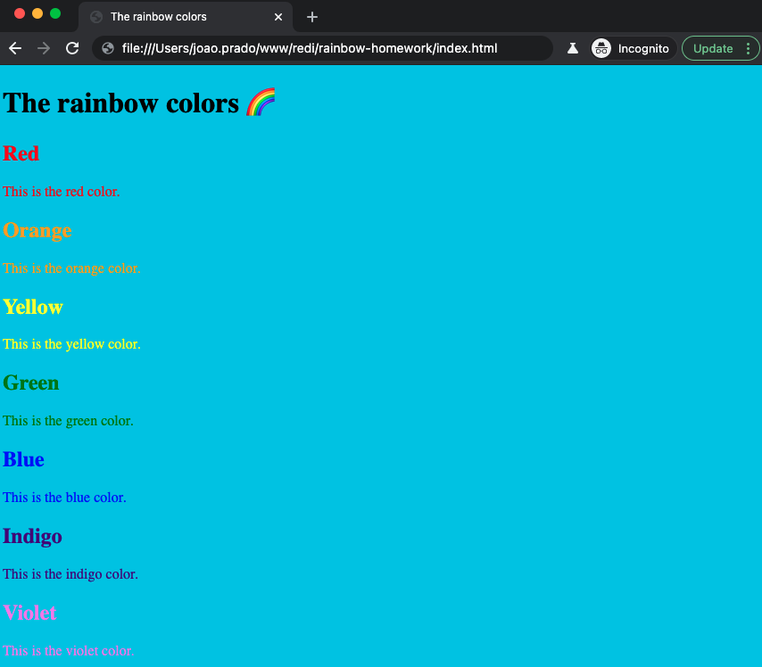

## Homework for the lesson "Introduction to FrontEnd"

## March 18th, 2021

The goal is to work on two tasks:

1. First task if to build our second website using "inline" css over heading tags, divs. Images are optional though.
2. Second task is to create a site where you try out for example eight of the css properties listed [here](https://developer.mozilla.org/en-US/docs/Web/CSS/CSS_Properties_Reference)

The website should consist in displaying all the colors of a rainbow by also adding a blue (sky blue) as the background of the page.

**ps**. If you have by any chance, color blindness, please reach out to @guicheffer and we can give you a different exercise.

## First task

### Rules

1. Create a HTML file similar to the one we created in the first lesson.
2. Use the following screenshot to guide you:

## Second task

### Rules

1. Create a HTML file similar to the one we created in the first task.
2. Create a similar website as the one we had in-class (like the favorite animals) but for your favorite movie/tv serie.
3. This website should contain eight of the css properties listed [here](https://developer.mozilla.org/en-US/docs/Web/CSS/CSS_Properties_Reference).
4. Sky is the limit, feel free to style the way you want and to display the content you want
5. Make sure you use anchors and images